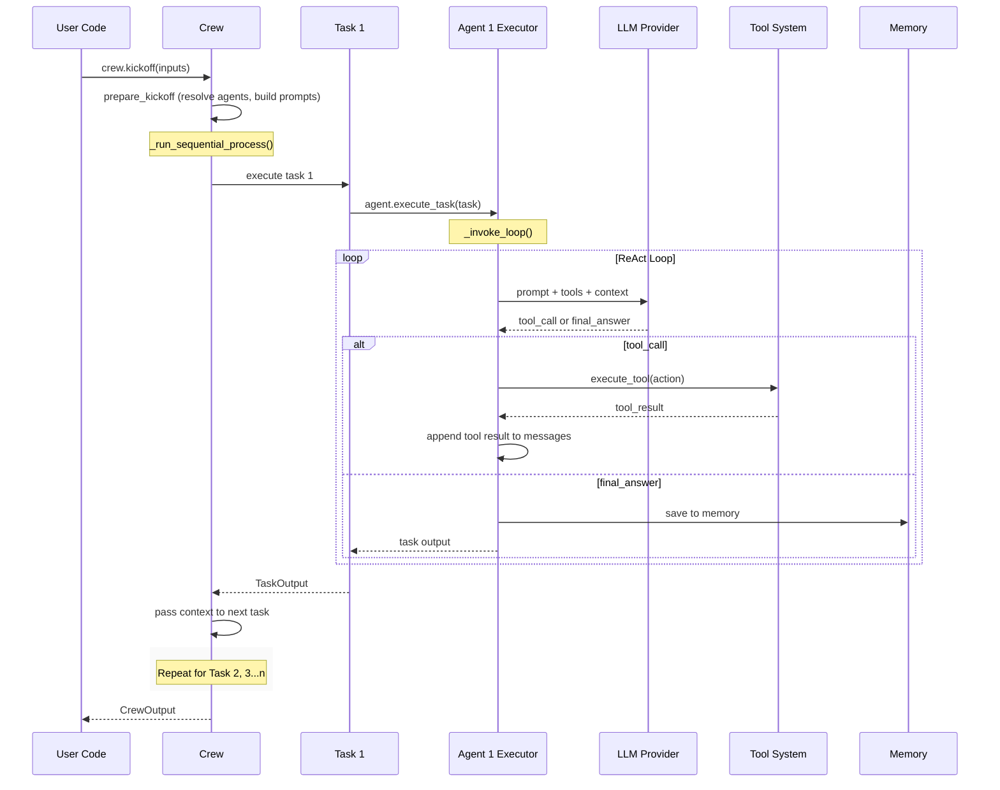

# CrewAI · 架構

## 高層元件圖

```mermaid
flowchart TB
  subgraph "Public API"
    Crew[Crew<br/>crew.py:963]
    Agent[Agent<br/>agent/core.py]
    Task[Task<br/>task.py]
    Flow[Flow DSL<br/>flow/flow.py]
  end

  subgraph "Execution Engine"
    Seq[Sequential Process<br/>crew.py:1464]
    Hier[Hierarchical Process<br/>crew.py:1468]
    Executor[CrewAgentExecutor<br/>agents/crew_agent_executor.py]
    ExAgent[AgentExecutor (experimental)<br/>experimental/agent_executor.py]
  end

  subgraph "Agent Loop"
    ReAct[ReAct Text Loop<br/>_invoke_loop_react]
    Native[Native Function Calling<br/>_invoke_loop_native_tools]
    Parser[Output Parser<br/>agents/parser.py]
  end

  subgraph "Tool System"
    BaseTool[BaseTool<br/>tools/base_tool.py]
    StructTool[CrewStructuredTool<br/>tools/structured_tool.py]
    ToolUsage[Tool Usage<br/>tools/tool_usage.py]
    MCP[MCP Integration<br/>mcp/client.py]
  end

  subgraph "Memory & State"
    Memory[Memory<br/>memory/unified_memory.py]
    Checkpoint[Checkpoint<br/>state/checkpoint_config.py]
    RuntimeSt[RuntimeState<br/>state/runtime.py]
  end

  subgraph "Infrastructure"
    LLM[LLM Abstraction<br/>llms/base_llm.py]
    EventBus[Event Bus<br/>events/event_bus.py]
    Prompts[Prompt System<br/>utilities/prompts.py]
    I18N[i18n<br/>utilities/i18n.py]
  end

  User((User)) --> Crew
  User --> Flow
  Crew --> Seq
  Crew --> Hier
  Seq & Hier --> ExAgent
  Seq & Hier --> Executor
  Executor --> ReAct
  Executor --> Native
  ReAct & Native --> Parser
  ReAct & Native --> ToolUsage
  ToolUsage --> BaseTool
  BaseTool --> StructTool
  StructTool --> MCP
  Executor --> LLM
  Executor --> Memory
  Executor --> EventBus
  Crew --> Checkpoint
  Checkpoint --> RuntimeSt
  Crew --> Prompts
  Prompts --> I18N
```

**圖意說明**: 這張圖展示 CrewAI 的四層架構。頂層 Public API 是使用者接觸的介面（Crew、Agent、Task、Flow）；Execution Engine 層負責將高層宣告轉化為實際執行流程；Agent Loop 層是 agent 的核心思考-行動循環；底層則涵蓋工具、記憶、狀態、LLM 抽象等基礎設施。箭頭不完全反映 class 繼承關係，而是顯示「誰依賴誰執行」的執行流程。

## 資料流圖（Sequential Process）



**圖意說明**: 這是 sequential process 的典型執行流程。Crew 依序呼叫每個 Task，每個 Task 由其指定的 Agent 執行。Agent 進入 ReAct 循環，反覆呼叫 LLM、解析 response、執行 tool，直到得到最終答案。每個 Task 的輸出會傳遞給下一個 Task 作為 context。

## Agent 控制流

### 主迴圈位置

[`lib/crewai/src/crewai/agents/crew_agent_executor.py:306`](https://github.com/crewAIInc/crewAI/blob/ee70702/lib/crewai/src/crewai/agents/crew_agent_executor.py#L306)

### 控制流類型

CrewAI 採用雙軌 agent loop 設計：

1. **Native function calling** — 當 LLM provider 支援 native function calling 時，直接使用 LLM 的 tool call 機制。LLM 回傳結構化的工具呼叫，由 executor 解析並執行。這是現代 agent 框架的主流做法。
2. **ReAct text pattern (fallback)** — 當 LLM 不支援 native function calling 時，用傳統的 ReAct 模式：將 tool description 嵌入 prompt，LLM 以文字輸出 Action / Action Input，由 parser 解析。

選擇邏輯在 `_invoke_loop()` 方法（L306-325）：

```python
use_native_tools = (
    hasattr(self.llm, "supports_function_calling")
    and self.llm.supports_function_calling()
    and self.original_tools
)
if use_native_tools:
    return self._invoke_loop_native_tools()
return self._invoke_loop_react()
```

**Trade-off**: 雙軌設計讓 CrewAI 可以相容更多 LLM provider（包括那些不支援 function calling 的），但代價是維護兩套完全不同的解析邏輯。CrewAgentExecutor 本身已被標記為 deprecated（L142-148），正逐步遷移到 `experimental/agent_executor.py` 的 `AgentExecutor`。

### 終止條件

- **max_iter 上限**: 預設 15 次迭代（在 BaseAgent 中定義），超過時 trigger `handle_max_iterations_exceeded()`（L340-349）
- **LLM 回傳 final answer**: 當 parser 解析到 AgentFinish 而非 AgentAction 時循環終止（L337-338）

### 錯誤處理

- **OutputParserError**: 當 LLM 回傳無法解析的格式時，`handle_output_parser_exception()` 會把錯誤訊息餵回 LLM 讓它修正（L431-438）
- **Context length exceeded**: 偵測到 context window 超限時，`handle_context_length()` 會自動刪減歷史訊息重新嘗試（L444-453）
- **Unknown errors**: litellm 層的錯誤直接 raise，其他錯誤由 `handle_unknown_error()` 處理

### 一個 turn 的具體流程（ReAct 模式）

```
1. 從 Task 取得 inputs,組裝 system prompt + user prompt
2. 附加 tool descriptions、memory context、knowledge context
3. 呼叫 LLM
4. 解析 response
   a. 若是 tool call → 執行 tool,將結果加入 messages → 回到 step 3
   b. 若是 final answer → 寫入 memory → 返回結果
5. 超過 max_iter → 強制終止,回傳最後的 partial answer
6. 若有 human_input flag → 暫停等待使用者輸入
```

## Prompt 管理

- **System prompts**: 透過 `Prompts` class（`utilities/prompts.py:45`）管理，結構由 `SystemPromptResult` / `StandardPromptResult` 封裝
- **i18n 模組**: prompts 文字儲存在 `utilities/i18n.py`，支援多語言角色、目標、背景故事的定義
- **動態組裝邏輯**: `crew_agent_executor.py:167-201` 的 `_setup_messages()` 方法負責把 system prompt、user prompt、tool descriptions 組合成 LLM 的 message list
- **Cache breakpoints**: 在 system prompt 結尾和 user prompt 結尾設定 cache 中斷點（`mark_cache_breakpoint`），讓 LLM cache 在 ReAct 循環中只對變動部分失效（L186-196）

**Trade-off**: 用 i18n 模組而非模板引擎（Jinja2 等）管理 prompt。好處是統一管理且支援多語言，缺點是動態變數注入依賴 Python 字串格式化（`.format()`），缺乏模板引擎的類型安全。

## Tool / Function 系統

- **Tool 註冊方式**: `BaseTool`（`tools/base_tool.py`）是抽象基底，透過裝飾器或 class 定義。`CrewStructuredTool`（`tools/structured_tool.py`）包裝成 LLM-friendly 的 schema
- **Tool schema 定義**: Pydantic model 自動產出 JSON Schema，餵給 LLM 的 function calling API
- **Tool 呼叫協定**: 雙軌 — native function calling（LLM 直接回傳 structured tool call）或 ReAct 文字解析（Action/Action Input 格式）
- **Tool 錯誤處理**: `execute_tool_and_check_finality()`（`utilities/tool_utils.py`）處理執行結果，失敗時回傳錯誤訊息給 LLM 讓它重新調整呼叫參數
- **MCP 整合**: `mcp/client.py` 實作 MCP（Model Context Protocol）客戶端，可以註冊外部 MCP server 的 tools

## Memory 架構

### Short-term（對話內）

- **儲存形式**: messages list（每個 agent executor 維護自己的 `self.messages`）
- **截斷策略**: 當 context length exceeded 時自動刪減歷史。`respect_context_window` flag 控制是否在所有 LLM 呼叫前檢查

### Long-term（跨對話）

- **後端支援**: `memory/unified_memory.py` — 可插拔設計，透過 `EmbedderConfig` 設定向量資料庫
- **寫入時機**: Agent 完成一個 task 後自動儲存（`_save_to_memory()` in crew_agent_executor.py）
- **讀取策略**: `Memory` object 持有多個 storage backend（short-term / long-term / entity / user），透過 `_ensure_memory_kind()` 決定查詢範圍

### State 管理

- **Checkpoint**: v1.14 引入的完整 checkpoint 機制（`state/checkpoint_config.py`、`state/runtime.py`）。可以將執行中的 Crew 序列化（含完成的 task outputs、agent messages、event record），後續透過 `Crew.from_checkpoint()` 還原並續跑
- **RuntimeState**: `state/runtime.py` 定義了 checkpoint 的資料結構，支援 `fork()` 建立執行分支
- **序列化方式**: Pydantic model，透過 `model_dump()` / `model_validate()` JSON 序列化

## LLM Provider 抽象

- **抽象方式**: `BaseLLM`（`llms/base_llm.py`）定義介面，實際實作委託給 litellm。`llms/providers/` 目錄下有 provider-specific 實作（如 OpenAI、Anthropic 等）
- **支援的 providers**: 透過 litellm 支援超過 100 個 LLM provider
- **切換 provider**: 只需在 Agent 或 Crew 的 `llm` 參數傳入不同的 provider string（如 `"gpt-4"`、`"claude-sonnet-4"`、`"ollama/llama3"`）

## Multi-agent

- **Agents 數量與角色**: 任意數量，每個 Agent 有自己的 `role`、`goal`、`backstory`
- **編排者**: 
  - Sequential: 無 central orchestrator，任務依序由對應 agent 執行
  - Hierarchical: `manager_agent`（使用者自訂或自動建立的 manager）負責分配工作給 worker agents。Manager 擁有 `AgentTools`（一個內建 tool 封裝，可以 delegate 任務給其他 agent）
- **訊息傳遞**: 在 Crew 層，task output 作為下一個 task 的 context 傳遞。在 Agent 層，透過 shared crew reference 讀取其他 agent 的輸出
- **Manager agent 設計**: `_create_manager_agent()`（crew.py:1473）自動建立 manager 時，會賦予 `AgentTools`（tools 為 delegation 專用），並明確限制 manager 不應有一般 tool（L1477-1484）

## 觀測性與評估

- **Tracing**: 透過 OpenTelemetry 實作。`events/listeners/tracing/` 下有 TraceCollectionListener（L78-84）
- **Token / cost 追蹤**: `TokenCalcHandler`（callback-based）在每次 LLM 呼叫時計算 token
- **內建 evaluation**: `utilities/evaluators/` 下有 `CrewEvaluator` 和 `TaskEvaluator`

## 安全與護欄

- **Input validation**: Pydantic model validation（所有 class 都繼承 BaseModel）
- **Tool 權限控制**: `security/security_config.py` 的 `Fingerprint` 機制對 agent/tool 標記身分
- **Cost / iteration 上限**: `max_rpm`（每分鐘請求上限）+ `max_iter`（每次執行最大迭代數）
- **Guardrails**: `tasks/llm_guardrail.py` 和 `tasks/hallucination_guardrail.py` 提供 task 層級的護欄檢查

## 關鍵設計決策與取捨

### 1. 從零自建 vs 基於 LangChain

CrewAI 選擇完全從零打造，不依賴 LangChain。這讓它的程式碼架構更乾淨（沒有繼承 LangChain 的 legacy class），但代價是：

- 需要自己實作 LLM 抽象層（雖然底層透過 litellm 轉接）
- 沒有自動繼承 LangChain 生態的工具和整合
- 團隊需要維護更多自有程式碼

**我們的判斷**: 對一個 agent 框架來說，這個選擇是合理的。LangChain 的抽象層太多，繼承它會讓框架設計受制於上游的 API 變動。CrewAI 的乾淨架構直接反映了這個決策的價值。

### 2. 宣告式 Task 模型 vs 程式化 Graph

不同於 LangGraph 的 StateGraph（開發者以程式碼建構圖形），CrewAI 用純宣告式的 Task list 定義工作流程。這讓入門門檻低很多，但靈活性也有代價：

- sequential / hierarchical 兩種模式無法涵蓋所有協作場景（雖然 Flow DSL 補上了這個缺口）
- 複雜的條件分支需要透過 `ConditionalTask`（`tasks/conditional_task.py`）來實現
- 動態 task 數量（如 for-each pattern）需要 `kickoff_for_each()` API

### 3. 雙軌 agent loop 的維護成本

同時維護 native function calling 和 ReAct text pattern 兩套循環是明顯的歷史包袱。`CrewAgentExecutor` 已被標記為 deprecated，程式碼中有大量條件判斷（L315-325）在切換兩者。這在新版 `AgentExecutor`（experimental）中已逐步統一。

## 測試策略

- 使用 pytest + asyncio（strict mode）
- vcr.py（pytest-recording）錄製 LLM 回放，解決非確定性測試問題
- `--block-network` 強制測試不依賴外部服務（透過 recordings）
- 每個子套件（crewai、crewai-tools、cli 等）有獨立 test directory
- 支援 pytest-xdist 平行執行

## 想學更多時，從這裡開始

- Agent loop 入口: `agents/crew_agent_executor.py:306`
- Crew orchestration 入口: `crew.py:963`
- Flow DSL: `flow/flow.py`
- Tool system 基底: `tools/base_tool.py`
- Checkpoint 機制: `state/checkpoint_config.py`
