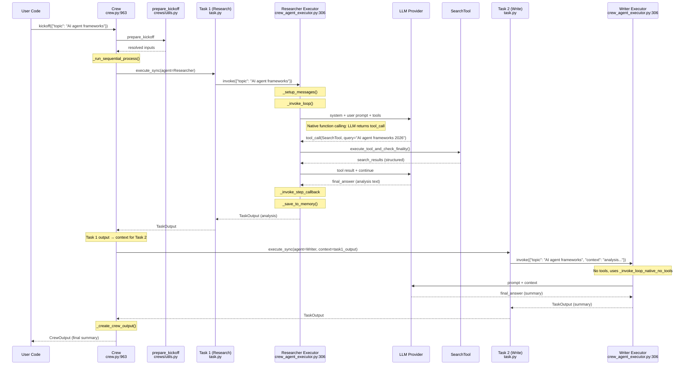

# CrewAI · 程式碼追蹤

## 追蹤的場景

**任務**: 一個 2-agent sequential crew：Researcher 先搜尋資料，Writer 根據資料寫摘要。

**預期的執行行為**:
1. Crew 接收 inputs（{"topic": "AI agent frameworks"}）
2. Researcher agent 執行 task 1（Search & Analyze）
   - Agent 呼叫 SearchTool（native function calling）
   - 取得結果，輸出分析報告
3. Task 1 的輸出作為 context 傳給 Task 2
4. Writer agent 執行 task 2（Write Summary）
   - 讀取 context，撰寫摘要（無 tool calling）
   - 輸出最終結果

## 流程圖



**圖意說明**: 這是 sequential process 的完整執行路徑。兩個 agent 依序執行：Researcher 使用 SearchTool（native function calling），Writer 只依賴 context 撰寫（無 tool）。關鍵是 Task 1 的輸出如何透過 Crew 的 `_get_context()` 傳遞給 Task 2。

## 逐步追蹤

### Step 0: Crew 初始化與準備

- 入口點: [`crew.py:963`](https://github.com/crewAIInc/crewAI/blob/ee70702/lib/crewai/src/crewai/crew.py#L963) — `Crew.kickoff()`
- 輸入驗證與準備: [`crews/utils.py`](https://github.com/crewAIInc/crewAI/blob/ee70702/lib/crewai/src/crewai/crews/utils.py) — `prepare_kickoff()` 解析 inputs、處理 input_files、執行 before_kickoff_callbacks
- Process 分發: [`crew.py:1019-1026`](https://github.com/crewAIInc/crewAI/blob/ee70702/lib/crewai/src/crewai/crew.py#L1019-L1026) — 根據 `self.process` 決定 sequential 或 hierarchical

這裡有一個重要的 checkpoint 整合點：若 `from_checkpoint` 參數提供且 `restore_from` 已設定，`apply_checkpoint()` 會先還原狀態（L981-983）。

### Step 1: Task 執行迴圈

- [`crew.py:1508-1577`](https://github.com/crewAIInc/crewAI/blob/ee70702/lib/crewai/src/crewai/crew.py#L1508-L1577) — `_execute_tasks()`
- 對每個 task 依序：
  1. `prepare_task_execution()` → 解析 task 要用的 agent 和 tools（含 context 組裝）
  2. 檢查是否為 `ConditionalTask` → 若是，決定是否跳過
  3. 檢查 `task.async_execution` → 非同步 task 可以平行執行
  4. 同步 task 直接 `task.execute_sync(agent, context, tools)`

**程式碼引用**: 關鍵的 context 組裝在 [`crew.py:1548-1549`](https://github.com/crewAIInc/crewAI/blob/ee70702/lib/crewai/src/crewai/crew.py#L1548-L1549)：
```python
context = self._get_context(
    task, [last_sync_output] if last_sync_output else []
)
```
`_get_context()` 預設只傳遞上一個同步 task 的輸出到下一個。這跟 `Task(context=...)` 參數的語意不同：後者是指 task 的描述中可嵌入的變數。

### Step 2: Task 執行與 Agent Invoke

- [`task.py`](https://github.com/crewAIInc/crewAI/blob/ee70702/lib/crewai/src/crewai/task.py) — `Task.execute_sync()`
- 內部呼叫 `agent.agent_executor.invoke(inputs)`，其中 `inputs` 包含 task 的 context、tools、expected_output 等
- Agent Executor 初始化（若尚未初始化）：建立 `CrewAgentExecutor` 或 `AgentExecutor` 實例

**控制流分支點**: 這裡的 executor 有兩種可能：
- `CrewAgentExecutor` (deprecated, L95-100) — 傳統實現，雙軌 loop
- `AgentExecutor` (experimental, 新預設) — 較新的實現，在 `experimental/agent_executor.py`

### Step 3: Agent Loop 初始化

- [`crew_agent_executor.py:205-244`](https://github.com/crewAIInc/crewAI/blob/ee70702/lib/crewai/src/crewai/agents/crew_agent_executor.py#L205-L244) — `invoke()`
- `_setup_messages(inputs)` 組裝 system + user prompt（L167-203）
- `_inject_multimodal_files(inputs)` 處理檔案附件（L246-304）
- 進入 `_invoke_loop()`（L306-325）

**Step 3 的關鍵序列化事件**: messages 從空開始，每次 LLM 呼叫累積。這是整個狀態中最容易膨脹的部分，也是 checkpoint 機制需要序列化的核心資料。

### Step 4: LLM 呼叫（Researcher，有 tool）

- Researcher 有 SearchTool → `use_native_tools = True` → 進入 `_invoke_loop_native_tools()`（L467-575）
- `convert_tools_to_openai_schema()` 將工具的 Pydantic schema 轉換為 OpenAI-compatible format（L480-482）
- `get_llm_response()` 執行實際的 LLM 呼叫（L500-512）

**可能出問題的地方**: 若 LLM 回傳的 tool call 格式不符合預期，`_is_tool_call_list()`（L614-645）需要處理多種格式（OpenAI format、Anthropic tool_use、自訂 dict 格式）。這是跨 provider 相容性最脆弱的環節。

### Step 5: Tool 執行

- [`crew_agent_executor.py:647`](https://github.com/crewAIInc/crewAI/blob/ee70702/lib/crewai/src/crewai/agents/crew_agent_executor.py#L647) — `_handle_native_tool_calls()`
- 解析 tool call 的 name 和 arguments
- 透過 `execute_tool_and_check_finality()`（`utilities/tool_utils.py`）執行對應的 tool function
- 若 tool 執行結果包含 `is_final=True`，直接回傳 AgentFinish（表示 tool 已產生最終答案）
- 否則將 tool result 加入 messages 並繼續循環

**錯誤路徑**: Tool 執行可能失敗（API timeout、參數錯誤等）。失敗資訊以文字形式加入 messages，LLM 可以重新調整參數再試。沒有自動 retry 機制，完全依賴 LLM 的自我修正能力。

### Step 6: 結果處理與輸出

- Researcher 的 LLM 回傳 final answer → `AgentFinish` 物件
- `_save_to_memory(formatted_answer)` — 寫入長期記憶（若啟用）
- 回傳 `{"output": formatted_answer.output}`
- Task 封裝為 `TaskOutput`（`tasks/task_output.py`）
- Crew 收集到 `task_outputs` list 中

### Step 7: Context 傳遞到 Task 2

- [`crew.py:1564`](https://github.com/crewAIInc/crewAI/blob/ee70702/lib/crewai/src/crewai/crew.py#L1564) — `_get_context(task, task_outputs)` 將前一個 task 的輸出轉換為字串，作為下一個 task 的 context 變數
- Task 2 (Writer) 執行時，其 prompt 中的 `{context}` 佔位符會被替換為 Researcher 的輸出

此處有一個微妙但重要的設計：context 傳遞是**純文字拼接**，結構化資料（如 JSON）在傳遞過程中會喪失型別資訊。對於需要精確結構化輸出的場景，應使用 `output_json` 或 `output_pydantic` 設定 Task 的輸出格式。

### Step 8: Writer Agent 執行（無 tool）

- Writer 無 tool → `_invoke_loop_native_no_tools()`（L577-612）
- 簡單的單次 LLM 呼叫：送 prompt + context → 回傳 final answer
- 無 ReAct 循環，無 tool dispatch
- 回傳 `TaskOutput`

### Step 9: 匯總結果

- [`crew.py:1577`](https://github.com/crewAIInc/crewAI/blob/ee70702/lib/crewai/src/crewai/crew.py#L1577) — `_create_crew_output(task_outputs)` 將所有 task output 匯總為 `CrewOutput`
- 執行 `after_kickoff_callbacks`、`_post_kickoff()`
- 計算 `usage_metrics`（總 token 消耗）
- 若有 `_memory`，執行 `drain_writes()` 確保所有 pending 的記憶寫入完成
- 清理 crew files（`clear_files(self.id)`）

## 想學更多時，在哪裡下中斷點

- Agent loop 起點: `crew_agent_executor.py:306`（`_invoke_loop`)
- LLM call 前一刻（看完整 prompt）: `crew_agent_executor.py:357`（`get_llm_response` 呼叫處）
- Tool dispatch: `crew_agent_executor.py:412`（`execute_tool_and_check_finality`）
- Memory 寫入: `crew_agent_executor.py:243`（`_save_to_memory`)
- Context 傳遞: `crew.py:1548-1564`（`_get_context`）

## 沒追蹤到但值得留意的分支

- **Hierarchical process**: 不同於 sequential，manager agent 會使用 `AgentTools` 委派任務給 worker agent，這是一層額外的 agent-invokes-agent 的遞迴呼叫
- **Async task execution**: `task.async_execution=True` 時，多個 task 可以平行執行，由 `ThreadPoolExecutor` 管理
- **Flow DSL**: 不透過 Crew，直接使用 `@start` / `@listen` 裝飾器定義事件驅動的工作流程
- **Checkpoint restore**: `Crew.from_checkpoint()` 從序列化狀態重建，跳過已完成的 task
- **Human-in-the-loop**: `ask_for_human_input=True` 時，agent 會在執行過程中暫停等待使用者輸入
