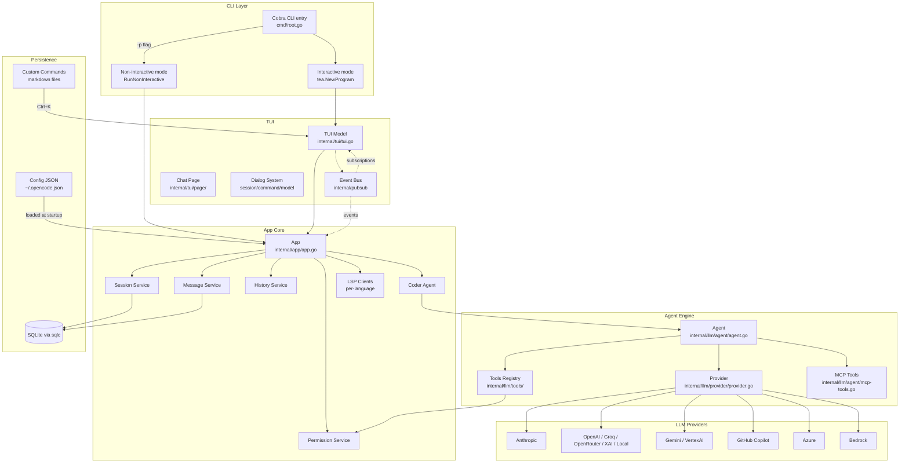

# OpenCode · 架構

## 高層架構



### 圖意說明

這張圖展示 OpenCode 的四層架構。上層是 CLI 入口（Cobra），分為互動模式（走 TUI）與非互動模式（直接拿結果）。中間是 App Core，凝聚了所有業務服務——Session、Message、History、Permission 與 Coder Agent。Agent Engine 處理 LLM 的串流與工具呼叫；Provider 層負責將統一的 `ProviderClient` 介面對接到 9 個不同的 LLM API。最下方是持久層（SQLite）與 UI 的 pubsub 事件匯流排，後者是 Go 程之間非同步通訊的核心。

## 內部分層

### CLI 層（cmd/root.go）

- **職責**：解析命令列參數，決定互動或非互動模式，初始化 Config、DB、App，啟動 TUI
- **位置**：[`cmd/root.go:24`](https://github.com/opencode-ai/opencode/blob/73ee493/cmd/root.go#L24)
- **對其他層的依賴**：強依賴 `app.New()`（App Core），間接依賴所有子系統

### App Core（internal/app/app.go）

- **職責**：服務的組合根（composition root）。建立 Session、Message、History、Permission 服務，初始化 LSP clients，建立 Coder Agent
- **位置**：[`internal/app/app.go:25`](https://github.com/opencode-ai/opencode/blob/73ee493/internal/app/app.go#L25)
- **設計選擇**：App 只是一個普通的 struct（不是 interface），因為只有一個實作。這是 pragmatism 而非 abstraction-for-the-sake-of-it

### Agent Engine（internal/llm/agent/）

- **職責**：實作 agent 主迴圈——串流 LLM 回應、處理 tool call、管理 session-level 的並發請求
- **Service interface**：[`internal/llm/agent/agent.go:48`](https://github.com/opencode-ai/opencode/blob/73ee493/internal/llm/agent/agent.go#L48)
- 定義了 `Run(ctx, sessionID, content)` → channel of events 的非同步合約

### Provider 抽象層

- **職責**：統一的 LLM 呼叫介面，支援 9+ provider
- **核心設計**：`baseProvider[C ProviderClient]` 是 Go generics 的應用。每個 provider 實作 `ProviderClient` 介面（send / stream），`baseProvider` 提供共用的 `SendMessages` 與 `StreamResponse`
- **位置**：[`internal/llm/provider/provider.go:81`](https://github.com/opencode-ai/opencode/blob/73ee493/internal/llm/provider/provider.go#L81)

### 權限系統（internal/permission/）

- **職責**：管控工具執行權限。每個危險操作（bash、edit、write）都會先經過 `permission.Request()` 檢查
- **設計**：同步的 blocking call——tool 執行時會 block 住等待 TUI 的使用者回應，TUI 透過 `Grant()` / `Deny()` 解鎖
- **位置**：[`internal/permission/permission.go:35`](https://github.com/opencode-ai/opencode/blob/73ee493/internal/permission/permission.go#L35)

### PubSub 事件系統

- **職責**：agent engine 的非同步事件需要送達 TUI（streaming text、permission request、session 變更），PubSub 是中間的 event bus
- **實作**：泛型 `Broker[T]` 支援泛訂閱，agent、session、message、permission、logging 各有自己的事件流
- **位置**：[`internal/pubsub/broker.go`](https://github.com/opencode-ai/opencode/blob/73ee493/internal/pubsub/broker.go)

## 核心設計決策與 Trade-off

### 決策 1：Go 而非 Python

**選擇理由**：Go 的單一二進位部署讓「安裝一個 AI coding agent」簡化成下載一個檔案，不必處理 Python 環境、虛擬環境、CUDA 依賴。對於 CLI 工具這是一個顯著的 UX 優勢。同時 Go 的 goroutine + channel 模型天然適合處理 streaming + tool execution 的非同步並發。

**代價**：Go 沒有像 Python 的 `inspect` 模組或豐富的 ML SDK 生態。如果未來需要整合複雜的 ML 工具鏈或 Python-only SDK，整合成本會比 Python-based 的工具高。

**對比**：Claude Code（TypeScript）與 Codex CLI（Python）都需要 runtime 環境。

### 決策 2：Bubble Tea TUI 而非 Web UI

**選擇理由**：完全在 terminal 內完成操作，不需要開瀏覽器。Bubble Tea 的 Elm Architecture 讓 UI 狀態管理清晰且有型別安全。

**代價**：TUI 的互動彈性遠低於 Web UI——複雜的表格、圖片顯示、多面板拖拽都難以實現。且 Bubble Tea 對滑鼠事件的支援有限。

**對比**：OpenHands 使用 Web UI，互動豐富但需要啟動 web server。

### 決策 3：Provider 層用 Go generics Type Parameter

**選擇理由**：`baseProvider[C ProviderClient]` 讓每個 provider client（`AnthropicClient`、`OpenAIClient`、`GeminiClient` 等）保有自己型別特有的 methods，不需要 `interface{}` 型別斷言。`SendMessages` 與 `StreamResponse` 由泛型基底提供，減少重複。

**代價**：Go 的 generics 不支援 virtual type methods，所以每個 provider client 仍然需要實作自己的 `send()` 和 `stream()` 方法。（詳見 Pattern 1）

**位置**：[`internal/llm/provider/provider.go:81-84`](https://github.com/opencode-ai/opencode/blob/73ee493/internal/llm/provider/provider.go#L81-L84)

### 決策 4：權限系統採用同步 blocking channel 而非 callback

**設計**：當 agent 需要執行一個需要許可的工具（如 `bash`），它會同步 block 在：
```go
<-respCh  // waits for user permission
```
這是在一個 goroutine 內發生的，因為 agent 執行本來就在 goroutine 中。TUI 端收到 `PermissionRequest` 事件後顯示 dialog，使用者按下 Allow 後呼叫 `Grant()` → channel 收到 `true` → agent 繼續。

**代價**：如果 TUI crash 或使用者沒回應，這個 goroutine 會永久 leak。系統透過 `context.Context` 取消來處理這種情況——session cancel 會取消 context，中斷等待。

**位置**：[`internal/permission/permission.go:74-100`](https://github.com/opencode-ai/opencode/blob/73ee493/internal/permission/permission.go#L74-L100)

## 跟外部世界的接觸面

- **CLI 入口**：[`cmd/root.go:24`](https://github.com/opencode-ai/opencode/blob/73ee493/cmd/root.go#L24)
- **環境變數**：每個 provider 有自己的 API key 環境變數（`ANTHROPIC_API_KEY`、`OPENAI_API_KEY`、`GEMINI_API_KEY` 等），見 README
- **配置檔案**：`~/.opencode.json`，使用 JSON 格式
- **自訂命令**：`~/.opencode/commands/*.md` 每行一個指令，支援 `$ARG` 參數
- **MCP 伺服器**：支援 MCP（Model Context Protocol）stdio 伺服器

## 配置系統

- **Config 入口**：[`internal/config/config.go`](https://github.com/opencode-ai/opencode/blob/73ee493/internal/config/config.go)
- **配置來源優先級**：config file > defaults
- **驗證機制**：config 載入時檢查 provider 設定是否有效

## 測試策略

- Go 專案有 131 個 `.go` 檔案、18k+ 行程式碼
- 測試檔案相對較少（只有 `ls_test.go`），符合早期開發尚未完善測試的狀態
- [UNVERIFIED] 較少測試覆蓋可能與專案早期封存有關

## 發布與版本管理

- **版本編號**：未使用 SemVer（尚未有正式 release）
- **CI**：GitHub Actions（`.github/workflows/`），使用 goreleaser 產出二進位
- **安裝方式**：`go install`、Homebrew、AUR、手動 install script
