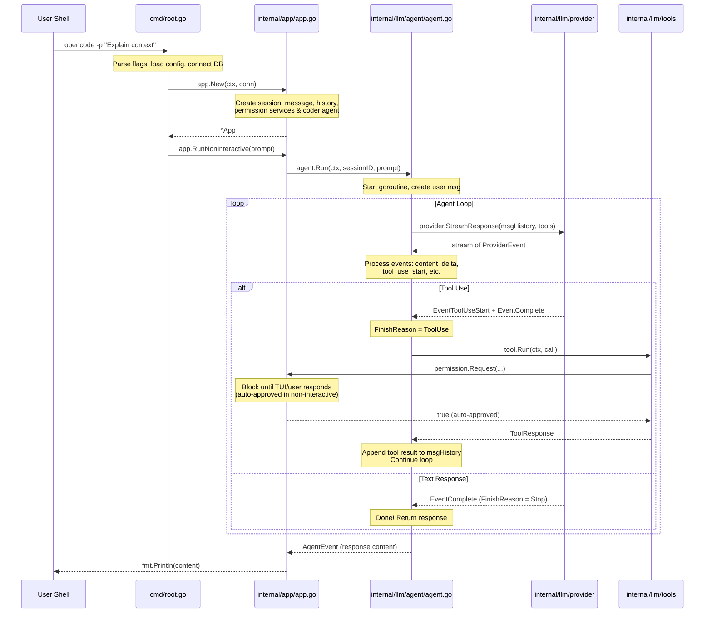

# OpenCode · 程式碼追蹤

## 追蹤的場景

我們追蹤非互動模式（`opencode -p "Explain the use of context in Go"`）的完整執行路徑。這條路徑涵蓋了 CLI 入口、App 啟動、Agent 初始化、Provider 串流、以及 tool call 迴圈，是理解 OpenCode 核心運作的最佳切入點。非互動模式比互動模式更乾淨——沒有 TUI、沒有 pubsub，直接走完整個 agent loop 後印出結果。

## 流程圖

### 圖意說明

這張 sequence diagram 展示了從使用者輸入 prompt 到最終輸出回應的完整路徑。核心的 agent loop 是一個「call LLM → 檢查是否有 tool call → 執行 tool → 繼續 call LLM」的 while 迴圈。在 Go 中，這透過 `processGeneration()` 的 for-loop 實現（[`agent.go:276-310`](https://github.com/opencode-ai/opencode/blob/73ee493/internal/llm/agent/agent.go#L276-L310)），每次 tool 執行結果被 append 到 `msgHistory` 後繼續串流。注意 `FinishReasonToolUse` 是是否繼續迴圈的判斷點。

## 逐步追蹤

### Step 1: CLI 入口

[`cmd/root.go:49-115`](https://github.com/opencode-ai/opencode/blob/73ee493/cmd/root.go#L49-L115)

Cobra 的 `RunE` handler。關鍵順序：
1. 解析 flags（`-d` debug、`-c` cwd、`-p` prompt、`-f` format、`-q` quiet）
2. `config.Load(cwd, debug)` — 載入 `~/.opencode.json`
3. `db.Connect()` — 初始化 SQLite（同時跑 migration）
4. `app.New(ctx, conn)` — 建立所有服務
5. `initMCPTools(ctx, app)` — 在背景 goroutine 初始化 MCP 工具串接
6. 若 `prompt != ""` → 走非互動模式

**值得注意**：
- Context cancellation chain：`context.WithCancel(context.Background())` 從最上層建立，透過 `app.Shutdown()` 層層取消
- MCP 工具初始化和 app 啟動是非同步的——app 還沒準備好 MCP tools 時，非互動模式也能正常運作（只是沒有 MCP tools）

### Step 2: App Core 初始化

[`internal/app/app.go:42-81`](https://github.com/opencode-ai/opencode/blob/73ee493/internal/app/app.go#L42-L81)

`New()` 做了四件關鍵事：
1. 從 SQLite 建立 `session.Service`、`message.Service`、`history.Service`
2. 建立 `permission.NewPermissionService()`
3. `go app.initLSPClients(ctx)` — 背景初始 LSP
4. `agent.NewAgent(config.AgentCoder, ...)` — 建立 coder agent，注入 11 個 tool

**值得注意**：
- LSP 是非同步初始化的，因為 LSP server 啟動可能很慢。這意味著 app 啟動後的前幾個請求可能還沒有 LSP 支援
- `CoderAgentTools()` 決定了 LLM 有 access 到哪些工具（[`tools.go:14-41`](https://github.com/opencode-ai/opencode/blob/73ee493/internal/llm/agent/tools.go#L14-L41)）

### Step 3: 非互動模式執行

[`internal/app/app.go:100-161`](https://github.com/opencode-ai/opencode/blob/73ee493/internal/app/app.go#L100-L161)

`RunNonInteractive`：
1. 建立 session（title 截取 prompt 前 100 字）
2. `AutoApproveSession(sess.ID)` — 非互動模式自動核准所有權限
3. `agent.Run(ctx, sess.ID, prompt)` — 啟動 agent 並等待結果 channel
4. `result := <-done` — 同步等待 agent 完成
5. `format.FormatOutput(content, outputFormat)` — 格式化輸出（text/json）

### Step 4: Agent Run — 啟動 goroutine

[`internal/llm/agent/agent.go:198-231`](https://github.com/opencode-ai/opencode/blob/73ee493/internal/llm/agent/agent.go#L198-L231)

`Run()` 做了：
1. 檢查 session 是否 busy（`sync.Map` 防止同一 session 的並發請求）
2. `context.WithCancel(ctx)` — 建立可取消的子 context
3. `activeRequests.Store(sessionID, cancel)` — 註冊取消函數
4. 啟動 goroutine 執行 `processGeneration()`
5. 回傳 `events` channel

**值得注意**：
- `activeRequests` 是 `sync.Map`，用 `sessionID` 作為 key 儲存 `context.CancelFunc`
- `Cancel(sessionID)` 可以從外部取消任何 session 的請求

### Step 5: 產生階段 — 主迴圈

[`internal/llm/agent/agent.go:233-311`](https://github.com/opencode-ai/opencode/blob/73ee493/internal/llm/agent/agent.go#L233-L311)

`processGeneration()`：
1. 從 DB 載入現有訊息。若為空，背景啟動 title generation
2. 處理 summary — 若 session 有 `SummaryMessageID`，截斷歷史到該點之後
3. 建立使用者訊息 `createUserMessage()`
4. 進入 for-loop：
   - 呼叫 `streamAndHandleEvents()` → 串流 LLM 回應 + 執行 tools
   - 檢查 finish reason → `FinishReasonToolUse` 則繼續，否則回傳

### Step 6: 串流與工具執行

[`internal/llm/agent/agent.go:322-438`](https://github.com/opencode-ai/opencode/blob/73ee493/internal/llm/agent/agent.go#L322-L438)

`streamAndHandleEvents()`：
1. `provider.StreamResponse(ctx, msgHistory, a.tools)` — 啟動 provider 串流
2. 建立空的 assistant message（先建立再逐步更新）
3. 逐個處理 `ProviderEvent`（content delta / tool call / error / complete）
4. LLM 回應結束後，遍歷所有 tool calls：
   - 查找註冊的 tool（透過 `Info().Name` 匹配）
   - 執行 `tool.Run(ctx, toolCall)`
   - 處理 permission denied 與其他錯誤
5. 將所有 tool results 包裝成一個 tool message
6. 回傳 `(assistantMsg, &toolMsg, nil)` → 主迴圈會繼續下一輪

### Step 7: Provider 串流

[`internal/llm/provider/provider.go:181-193`](https://github.com/opencode-ai/opencode/blob/73ee493/internal/llm/provider/provider.go#L181-L193)

`baseProvider[C].StreamResponse()`：
1. `cleanMessages()` — 過濾掉空的訊息
2. 委派給 `client.stream(ctx, messages, tools)` — 由實際的 client（如 AnthropicClient）處理
3. 每個 provider client 實作自己的串流邏輯（SSE、WebSocket 等），轉換為統一的 `ProviderEvent` channel

## 關鍵 control flow 分支點

- **非互動 vs 互動**：[`cmd/root.go:112`](https://github.com/opencode-ai/opencode/blob/73ee493/cmd/root.go#L112) — prompt flag 是否設定決定
- **FinishReasonToolUse 決定是否繼續**：[`agent.go:300-304`](https://github.com/opencode-ai/opencode/blob/73ee493/internal/llm/agent/agent.go#L300-L304) — 主迴圈的繼續條件
- **Permission denied 中斷全部 tool calls**：[`agent.go:396-411`](https://github.com/opencode-ai/opencode/blob/73ee493/internal/llm/agent/agent.go#L396-L411) — 任一 tool 被拒絕，後續全部標為取消
- **Auto-compact context 觸發**：[`tui.go:336-342`](https://github.com/opencode-ai/opencode/blob/73ee493/internal/tui/tui.go#L336-L342) — token 使用達 95% context window 自動摘要

## 想學更多時，在哪裡下中斷點

- CLI 入口: [`cmd/root.go:49`](https://github.com/opencode-ai/opencode/blob/73ee493/cmd/root.go#L49)
- Agent 主迴圈: [`internal/llm/agent/agent.go:276`](https://github.com/opencode-ai/opencode/blob/73ee493/internal/llm/agent/agent.go#L276)
- Provider 串流建立: [`internal/llm/provider/provider.go:190`](https://github.com/opencode-ai/opencode/blob/73ee493/internal/llm/provider/provider.go#L190)
- Tool 執行: [`internal/llm/agent/agent.go:390`](https://github.com/opencode-ai/opencode/blob/73ee493/internal/llm/agent/agent.go#L390)
- 權限請求 blocking call: [`internal/permission/permission.go:74`](https://github.com/opencode-ai/opencode/blob/73ee493/internal/permission/permission.go#L74)

## 沒追蹤到但值得留意

- **TUI 模式**：互動模式的 event flow 更複雜，多了 pubsub → TUI 的事件路徑。關鍵在 `setupSubscriptions()`（[`cmd/root.go:249`](https://github.com/opencode-ai/opencode/blob/73ee493/cmd/root.go#L249)）將 agent/message/session/permission 的事件透傳給 TUI
- **Summarize 路徑**：當 token 使用達 95% context window，會自動建立新 session 並摘要舊對話。這個路徑比較少見，值得另外分析
- **MCP 工具初始化**：`agent.GetMcpTools()`（[`cmd/root.go:204`](https://github.com/opencode-ai/opencode/blob/73ee493/cmd/root.go#L204)）在背景非同步初始化，成功後 MCP tools 自動註冊到 agent 的工具列表中
